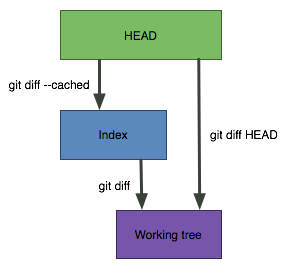
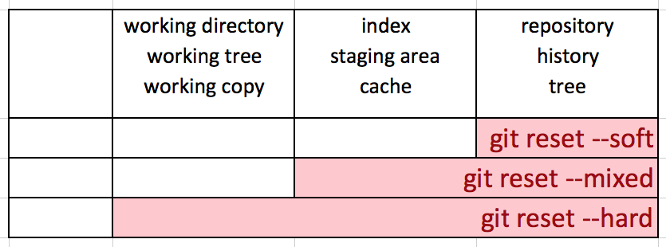

# GIT - Grammar

**CYCLE**\
작업 트리(실제 작업 디렉토리) > 스테이지(.git/index) > 커밋 > 저장소(.git/HEAD)

## 초기화 및 설정

### 초기화

- `git init`\
  .git 디렉토리 생성

### 복제

- `git clone 주소 dirName`
  - -b branchName --single-branch: 지정 브랜치만 가져옴
  - --mirror: 모든 브랜치를 가져옴

### 정보(유저) 설정

- `git config -l`
- `git config --global -l`
- `git config --local user.name "name"`
- `git config --local user.email "email"`
- `git config --unset user.name`\
  설정 된 user.name 제거
- `ssh -T git@github.com`\
  연결 확인

### 원격 저장소 설정

- `git remote -v`
- `git remote add origin <ssh 주소>`
- `git remote set-url origin <ssh 주소>`
- `git remote rename origin rename`
- `git remote rm origin`

 

## 상태 관리

- `git status`
- `git reflog`\
  헤더 및 브랜치 이동, 리셋 이력 확인
- `git log`
  - --stat: 커밋한 상태도 표시
  - --oneline: 한 줄로 표시
  - --branches: 다른 브랜치들도 함께 표시
  - --graph
  - ex) `git log --oneline --branches --graph`
- `git diff`\
  스테이징 파일과 비교, 없으면 최신(HEAD)과 비교
- `git diff HEAD origin/main`\
  로컬의 최신 커밋인 HEAD와 원격 브랜치를 비교(origin/main이 비교 기준브랜치가 됨)\
  

### STAGING

- `git add file`\
  `git add .`\
  Untracked files를 Tracked상태로 변경(스테이징)

### COMMIT

- `git commit -m "msg"`
  - --allow-empty: 수정사항 없이 커밋 가능
- `git commit --amend "msg"`\
  최근 커밋으로 합치기 - 스테이징에 변화가 없을 경우, 메세지만 변경

### 업데이트(PULL / PUSH / FETCH)

- `git pull`
  - 현재 브랜치를 업데이트
  - --all: 로컬의 모든 브랜치를 업데이트
  - --prune(또는 -p): 유효하지 않은 참조를 제거\
    원격에서는 지워진 브랜치지만 로컬(git branch -r)에서는 계속 남아 있는 경우
- `git push -u origin master`
  - -u: 처음 연결을 위한 것으로 최초 사용 이후는 생략
- `git fetch`
  - 위 pull옵션과 동일

### STASH

- `git stash`
- `git stash list`
- `git stash pop`\
  0(가장 최근)부터 꺼냄 - 0 삭제
- `git stash apply`\
  0을 삭제하지 않고 꺼냄
- `git stash drop`\
  0의 삭제

 

## 복원

### 수정 취소(discard)

- `git restore file`\
  `git restore .`\
  Untracked상태의 수정 된 파일을 되돌림

### add(STAGING) 취소

- `git restore --staged file`\
  `git restore --staged .`\
  내용 유지됨

### commit 취소

- soft
  - Commit 상태의 파일들을 Staged상태로 변경
    - 해당 커밋해쉬 파일들
  - working tree 유지
- mixed
  - Unstaged/Untracked file 상태로 되돌림
  - working tree 유지
- hard
  - 해당 커밋의 직후 상태로 되돌림

- `git reset HEAD^`\
  최신 커밋을 지움
- `git reset commitHash`\
  해당 커밋으로 HEAD를 이동
- `git reset --hard HEAD^`\
  - staging/tracked file and 작업내용을 다 지우고, 최신 커밋을 지움
  - 지우고난 최신 커밋의 실행 직후상태로 돌리는 것
- `git reset commitHash file`\
  soft, hard 사용 불가

### merge 병합 취소

- git merge --abort

### REVERT

커밋 이력이 유지되며, 되돌린 후 자동 커밋이 이루어짐

- `git revert commitHash`\
  해당 커밋을 하기전으로 되돌림(staged file이 없어야 함)
- `git revert HEAD`\
  최신 커밋을 되돌림

### CHEERY PICK

특정 커밋을 가져옴

- `git cherry-pick commitHash`

 

## 브랜치 관리

- `git branch`\
  브랜치들 표시
  - -r: 원격 브랜치만 표시
  - --all: 로컬 및 원격 브랜치 모두 표시
- `git branch branchName`\
  브랜치 생성
- `​​git branch branchName targetBranch`\
  브랜치에서 브랜치 생성
- `git switch branchName`
- `git switch -t origin/branchName`\
  원격 브랜치를 로컬에 생성 후 이동
- `git branch -m branchName`\
  브랜치 이름 변경

### 삭제

- `git branch -d branchName`\
  `git branch -d --remote origin/branchName`
- `git push origin --delete branchName`

### 동기화

해당 브랜치가 저장소에 없고(deleted after pr is merged),\
로컬의 원격 브랜치에도 없지만(git pull -p),\
로컬의 작업 브랜치에 남아있는 경우,

- `git branch --merged | egrep -v 'main|prod|dev' | xargs git branch -d`

 

## REBASE

- `git rebase -i HEAD~3`\
  최신 커밋부터 3개
- `git rebase -i commitHash^`\
  지정 커밋부터 최신까지(^주의)
- `git rebase -i --root`\
  최신 커밋부터 마지막 까지

### 커밋 합치기(s - squash)

1. `:2,마지막NUMs/^pick/s/`\
   또는 `:2,$s/^pick/s/` (전체)
2. `:wq`\
   충돌 시, 해결 후 `git rebase --continue`
3. `git push -f`

### 중간 커밋 수정(edit)

1. `git rebase --interactive commitHash^`
2. pick -> edit
3. :ZZ
4. 수정 후, `git add .` `git commit --amend`

## ETC

### 캐쉬 삭제

- `git rm --cached .`
  - -r: 원격저장소 지정
